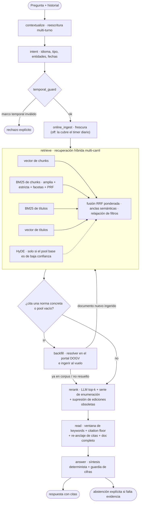

# DOGV AI

[English](README.md) · **Español**

Asistente RAG local para consultas sobre el DOGV (Diari Oficial de la Generalitat
Valenciana): empleo público, ayudas/subvenciones/premios y becas. Ingesta diaria
automatizada, búsqueda híbrida multi-carril sobre PostgreSQL, y respuestas con citas
verificables o abstención explícita cuando no hay evidencia. Todo el stack corre en
local (2× GPU de consumo); no sale ningún dato a servicios externos.

- **API**: FastAPI (`:8088`) — `POST /ask` y `POST /ask/stream` (SSE con progreso por etapa).
- **Orquestación**: LangGraph (`agent/graph.py`), un nodo por etapa del pipeline.
- **Almacenamiento**: PostgreSQL con `pgvector` (embeddings) + `tsvector` (BM25).
- **Chat LLM**: Qwen3.6-27B (int4 AutoRound) servido con **vLLM 0.23** — tensor-parallel 2,
  MTP speculative decoding, KV-cache fp8, prefix caching (`ops/dogv-chat.service`).
- **Embeddings**: bge-m3 (GGUF) servido con **llama.cpp** en un proceso aparte
  (`ops/dogv-embed.service`).
- **UI**: Chainlit (`:8501`) con streaming de progreso.
- Idiomas: castellano y valenciano (BM25 con configuración `catalan` y fallback a `spanish`).

## El pipeline de un vistazo



## Arquitectura

### 1) Ingesta (diaria, systemd timer)
- `scripts/sumario_ingest.py`: baja el sumario diario y hace upsert de issues
  (con captura de ediciones *bis* para no perder disposiciones en fechas con doble edición).
- `scripts/extract_documents.py`: crea documentos (disposiciones) por issue.
- `scripts/download_assets.py` / `download_html.py`: caché local de PDF/HTML.
- `scripts/extract_text.py`: texto limpio HTML-first con fallback a PDF.
- `scripts/classify_documents.py`: clasificación LLM de `doc_kind`/`doc_subkind`.
- `scripts/build_chunks.py`: chunking por tokens reales del tokenizer de bge-m3
  (300–500 tokens, solape 80) + embeddings de chunk, de título y de documento + `tsvector`.
- Ventana caliente: 24 meses rodantes (`scripts/maintain_indices.py` purga lo antiguo).

Tablas clave: `dogv_issues`, `dogv_documents`, `rag_chunk` (embedding + tsv),
`rag_title`, `rag_doc` (embedding a nivel documento). Migraciones en `sql/`.

### 2) Pipeline de consulta (LangGraph — `agent/graph.py`)
1. **contextualize** — reescribe turnos de seguimiento como consulta autónoma usando el
   historial (el servidor es stateless: el cliente envía `history` en cada petición).
2. **intent** — el LLM extrae idioma, `doc_kind`/`doc_subkind`, entidades y fechas.
3. **temporal_guard** — valida/filtra el marco temporal de la pregunta.
4. **online_ingest** — (opcional) ingesta de frescura; en producción la frescura la
   cubre el timer diario y esta vía está desactivada.
5. **retrieve** — recuperación híbrida multi-carril:
   - carriles: vector de chunks, BM25 de chunks (consulta amplia + estricta + por facetas
     + expansión PRF), BM25 de títulos y vector de títulos;
   - **HyDE con puerta de confianza**: solo se genera el documento hipotético cuando el
     margen RRF del pool base es bajo, y nunca para consultas que citan una norma concreta;
   - fusión **RRF ponderada** con desempate determinista, expansión adaptativa del pool
     cuando el margen es plano, y escalera de relajación de filtros
     (doc_kind → idioma → fechas);
   - **anclas semánticas**: un documento en el top-N de un carril semántico tiene plaza
     garantizada en el pool fusionado (evita que carriles BM25 correlacionados lo expulsen).
6. **backfill** — *fetch histórico bajo demanda*: si la pregunta cita una norma que no está
   en la ventana de 24 meses, se resuelve contra el buscador del portal DOGV, se ingiere al
   vuelo y se re-ejecuta la recuperación solo si de verdad se trajo algo nuevo.
7. **rerank** — re-ranking LLM del top de candidatos; para consultas de enumeración
   ("cítame todas las…") se amplía el pool con la serie mes+categoría vía SQL; supresión de
   **ediciones hermanas obsoletas** (publicaciones recurrentes casi idénticas por coseno de
   embedding de documento → se lee solo la edición más reciente).
8. **read** — selección de chunks por documento con truncado por **ventana de keywords**
   (no por prefijo), *citation floor* (todo documento seleccionado aporta una cita usable),
   re-anclaje de citas no literales del LLM al chunk fuente, y lectura de documento completo
   cuando la evidencia lo exige.
9. **answer** — síntesis determinista (thinking off, temperatura 0) + validador con
   **guardia de cifras unit-aware** (toda cantidad monetaria/porcentual debe existir en la
   fuente citada), reintento de reparación condicional, y citación forzada de la norma
   objetivo cuando la pregunta la nombra. Sin evidencia suficiente → abstención explícita.

### 3) Servicio (systemd)
Cuatro unidades + timer, con arranque ordenado por health-check (ver `ops/README.md`):
`dogv-chat` (vLLM :8000) → `dogv-embed` (llama.cpp :8001) → `dogv-api` (:8088) →
`dogv-chainlit` (:8501), agrupadas en `dogv.target`; `dogv-daily-ingest.timer` mantiene
el corpus al día. `scripts/demo_ctl.sh` reproduce el mismo stack a mano para desarrollo.

## Demo


*La UI de Chainlit mostrando en streaming el progreso por etapa de una consulta `/ask/stream`.*

## Configuración

Usa `.env.example` como plantilla. Las ~15 variables que de verdad importan:

| Variable | Qué controla |
|---|---|
| `DATABASE_URL` / `DOGV_DB_DSN` | PostgreSQL (SQLAlchemy / CLI) |
| `LLM_BASE_URL`, `LLM_MODEL` | Servidor de chat OpenAI-compatible (vLLM) |
| `EMBED_BASE_URL`, `EMBED_MODEL` | Servidor de embeddings (llama.cpp) |
| `ASK_LANES` | Carriles de recuperación activos (`vector,bm25,title`) |
| `ASK_MAX_DOCS`, `ASK_READ_MAX_DOCS` | Tamaño del pool fusionado / del conjunto de lectura |
| `ASK_HYDE_ENABLED` | HyDE con puerta de confianza |
| `ASK_SEMANTIC_ANCHOR_ENABLED` | Garantía de plaza para anclas semánticas |
| `ASK_EDITION_RECENCY_ENABLED` | Supresión de ediciones hermanas obsoletas |
| `ANSWER_CLAIM_GUARD_MODE` | Guardia de cifras (`unit_aware_strict` en producción) |
| `ASK_CONTEXTUALIZE_ENABLED` | Reescritura multi-turno |
| `BACKFILL_ENABLED` | Fetch histórico bajo demanda |
| `AUTO_INGEST_ENABLED` | Ingesta automática desde la API (OFF; la cubre el timer) |
| `WARM_INDEX_MONTHS` | Ventana rodante del corpus (24) |

La referencia completa de variables, con valores por defecto y justificación, está en
[`docs/CONFIG.md`](docs/CONFIG.md).

## Operativa rápida

```bash
# Bootstrap del índice (24 meses) o ingesta diaria
.venv/bin/python scripts/maintain_indices.py --bootstrap   # o --daily

# API
uvicorn api.main:app --host 0.0.0.0 --port 8088

# UI (otra terminal)
chainlit run ui/chainlit_app.py --host 0.0.0.0 --port 8501

# Stack completo manual (chat vLLM + embed llama.cpp + API + UI)
bash scripts/demo_ctl.sh start
```

## Endpoints

- `GET /health` — estado + frescura del índice + commit/config que está sirviendo.
- `GET /ready` — puerta de disponibilidad para tráfico.
- `GET /issues`, `GET /issues/{issue_id}/documents` — navegación del corpus.
- `POST /ask` — `{question, history?, debug?}` → `{answer, citations, debug?}`.
- `POST /ask/stream` — variante SSE: eventos `stage` por nodo del grafo, luego `result`.

## Evaluación

La suite dura (`data/eval_v2/`, 100 preguntas 50/50 va/es: claras, vagas, coloquiales,
con referencia errónea, multi-salto, de anexo y fuera de ámbito) puntúa **recuperación**
y **calidad de respuesta** por separado, con una puerta dura que anula cualquier
respuesta con un error factual material. Cada run queda ligado al commit exacto que lo
produjo (sidecar `.meta.json` + `/health`). Detalle: `data/eval_v2/README.md` y los
informes en `data/eval_v2/*.md`.

<!-- TODO(eval-refresh 2026-07-08): sustituir por los números del re-run en curso sobre
     master d11a8c2 (collect_answers → judge → score_answers; run_eval → retrieval_metrics;
     run_tester_regression) en cuanto termine. Los de abajo son del último run juzgado
     (junio 2026, mismo pipeline). -->
Últimos resultados (100Q, junio 2026):

| Métrica | Valor |
|---|---|
| Puntuación global (con puerta factual) | **0.783** |
| Fidelidad a la evidencia | 0.978 |
| Tasa de error crítico | 3.3% |
| Abstención fuera de ámbito | 10/10 |
| Recuperación (rerank) R@5 = R@10 | 0.767 |
| MRR (rerank) | 0.600 |
| Set de regresión del tester externo (30Q) | 30/30 |

**Limitaciones conocidas (medidas, no teóricas):** el recall satura en 0.767 a partir de
k=5 — un ~23% de las preguntas difíciles nunca recupera el documento oro (techo de los
embeddings, dominado por consultas vagas y por el valenciano, que va ~11 puntos por detrás
del castellano); la latencia mediana de `/ask` es ~50–60 s (pipeline multi-etapa con un
27B local); no hay OCR para PDFs escaneados.

Comandos:

```bash
# Respuestas end-to-end contra la API viva + agregación
.venv/bin/python eval_v2/collect_answers.py --base-url http://127.0.0.1:8088
.venv/bin/python eval_v2/score_answers.py <judgments.jsonl> <answers.jsonl> data/eval_v2/reports/answer_metrics.json

# Recuperación (recall/MRR/nDCG por etapa) + puerta de regresión
.venv/bin/python scripts/run_eval.py --input data/eval_v2/retrieval_input.json
.venv/bin/python eval_v2/retrieval_metrics.py data/eval_reports/<run_id>.json
.venv/bin/python scripts/check_eval_regression.py --report data/eval_reports/<run_id>.json

# Set de regresión del tester externo (30Q contra producción)
.venv/bin/python scripts/run_tester_regression.py --api http://localhost:8088
```

## Licencia

[MIT](LICENSE).
